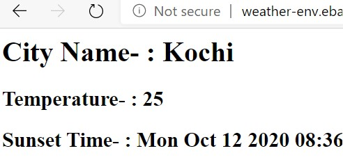

# simple_weather_app_Node.js

A bare-bones weather app I made using Node.js and the OpenWeather API. 
You just need to enter your API key and you are good to go. 

Ready to run as is on Elastic Beanstalk.

